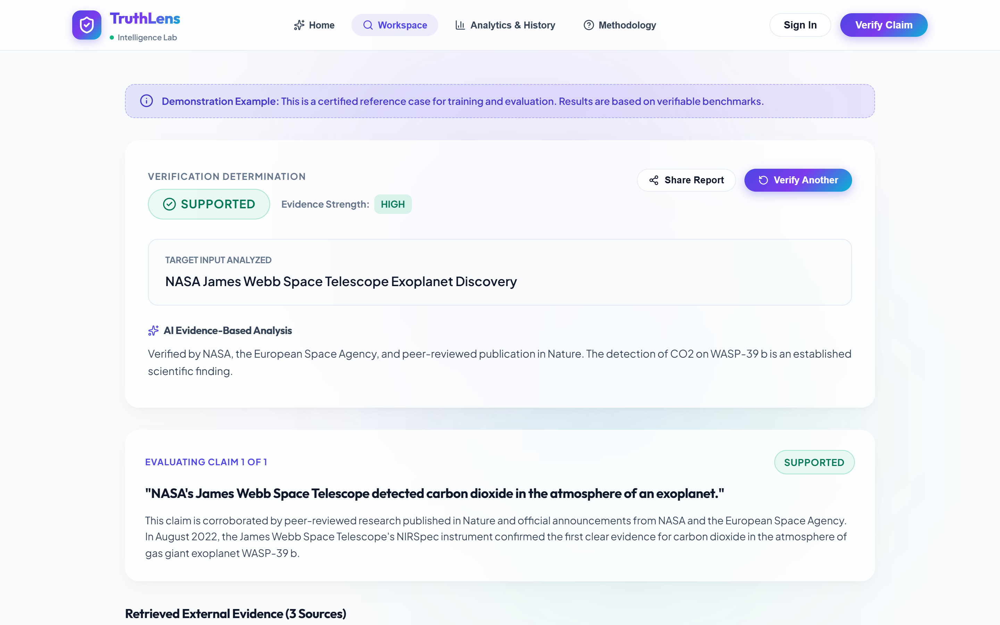
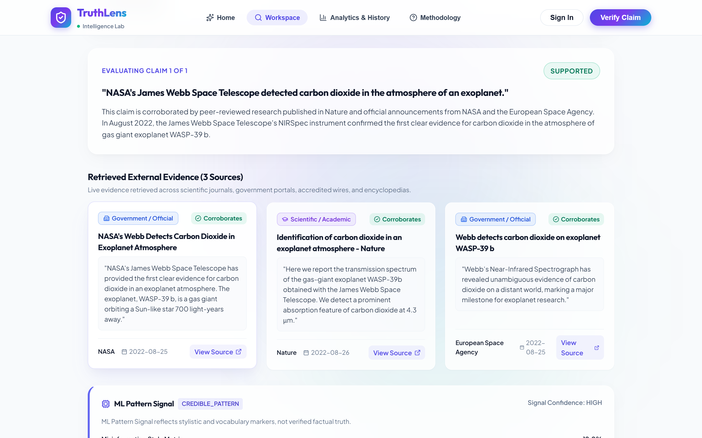
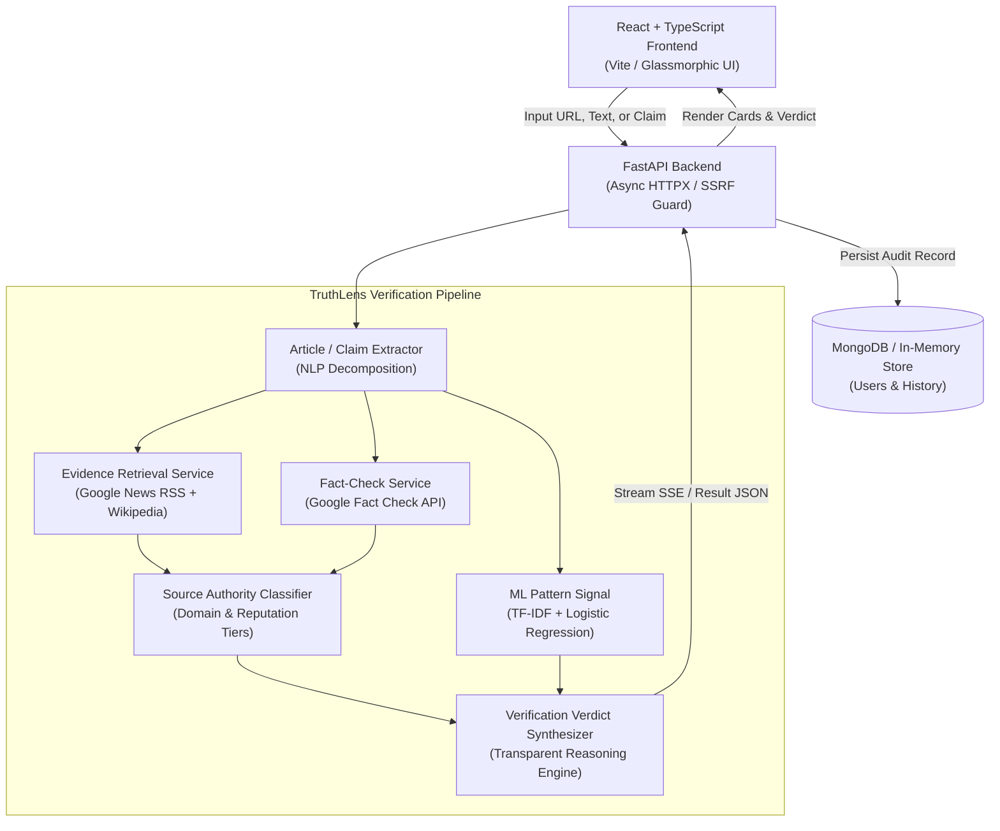

# TruthLens — AI-Powered News & Claim Verification System

[](https://www.python.org/)
[](https://fastapi.tiangolo.com/)
[](https://react.dev/)
[](https://www.typescriptlang.org/)
[](https://scikit-learn.org/)
[](https://www.mongodb.com/)
[](LICENSE)

> **TruthLens** is an AI-powered news and claim verification system that analyzes articles, headlines, and URLs, extracts factual claims, retrieves evidence from web and fact-checking sources, and evaluates whether claims are supported, contradicted, unverified, or misleading using NLP, machine learning, and transparent evidence analysis.

---

## Visual Showcase

| Landing Page & Hero | Verification Workspace |
|:---:|:---:|
|  |  |

| Verification Result & Verdict Breakdown | Live Evidence Cards & Stance Analysis |
|:---:|:---:|
|  |  |

| Analytics Dashboard & Search History | Responsive Mobile Layout |
|:---:|:---:|
|  |  |

---

## Features

* **AI claim extraction**: Natural language processing automatically extracts atomic, verifiable claims from compound sentences and full articles.
* **Live evidence retrieval**: Queries real-time sources including open news feeds, Google News RSS, and Wikipedia API without synthetic hallucinations.
* **Fact-check search**: Integrates with the Google Fact Check Tools API and indexed fact-checking archives (Snopes, PolitiFact, Full Fact).
* **Source classification**: Tiers publishers by authority (*Government / Official*, *Academic / Scientific*, *Established News*, *Fact-Check Organization*, *General Website*).
* **Evidence-based verification**: Compares retrieved stances, cross-referencing corroborating and conflicting primary sources.
* **Multi-claim analysis**: Parses multi-paragraph news articles, isolates independent claims, and computes individual verdicts.
* **ML Pattern Signal**: Scikit-Learn TF-IDF and Logistic Regression pipeline that flags sensationalist, hyperbolic, or clickbait linguistic patterns.
* **Real-time verification stages**: Server-Sent Events (SSE) stream progress live (`READING_CONTENT` &rarr; `EXTRACTING_CLAIMS` &rarr; `SEARCHING_EVIDENCE` &rarr; `COMPARING_SOURCES` &rarr; `GENERATING_EXPLANATION`).
* **URL analysis**: SSRF-protected safe scraping engine extracts clean article text, metadata, and handles redirects safely.
* **Verification history**: Stores user audit history in MongoDB (with automatic in-memory fallback for local dev).
* **Analytics dashboard**: Interactive metrics, verdict distributions, category breakdowns, and query history inspection.
* **Authentication**: Secure JWT sessions with bcrypt password hashing and optional anonymous verification.
* **Responsive glassmorphic UI**: Modern interface with smooth animations, accessible contrast, and mobile-friendly responsive design.

---

## How It Works

```text
User Input
    ↓
Article / Claim Extraction
    ↓
Claim Identification
    ↓
Web & Fact-Check Search
    ↓
Evidence Retrieval
    ↓
Source Analysis
    ↓
Evidence Comparison
    ↓
Verification Verdict
    ↓
Transparent Explanation
```

---

## Verdicts

| Verdict | Definition & Evidentiary Standard |
| :--- | :--- |
| 🟢 **SUPPORTED** | **Evidence supports the claim.**<br>Multiple authoritative sources (Academic, Government, or Major News) confirm the statement with verifiable evidence; no credible refutations found. |
| 🔴 **CONTRADICTED** | **Reliable evidence conflicts with the claim.**<br>Established authoritative sources or certified fact-checking organizations (Snopes, PolitiFact, CDC, FDA) provide direct counter-evidence debunking the statement. |
| 🟡 **UNVERIFIED** | **There is insufficient reliable evidence to establish the claim.**<br>Insufficient corroborating evidence could be found in public records. *Absence of evidence is never treated as proof of falsity.* |
| 🟠 **MISLEADING / MISSING CONTEXT** | **The claim may contain some truth but lacks important context or exaggerates the evidence.**<br>The assertion references genuine events or partial facts, but removes vital caveats, exaggerates scientific findings, or distorts facts. |

---

## ML Model

TruthLens incorporates a dedicated Machine Learning classification model:
* **Vectorization**: TF-IDF Vectorizer (unigrams + bigrams, sublinear term frequency scaling).
* **Classifier**: Regularized Logistic Regression with balanced class weights.
* **Role**: **ML Pattern Signal**

> [!IMPORTANT]
> **Responsible Evaluation:** The ML model score is **NOT** a probability that a claim is true or false. It identifies stylistic and linguistic patterns associated with sensationalism or misinformation phrasing in training data. It serves solely as one auxiliary signal within TruthLens's multi-layered evidence verification architecture.

---

## Tech Stack

### Frontend
* **React 19**
* **TypeScript**
* **Vite**
* **Vanilla CSS** (Custom Bright Glass Design System)
* **Lucide React** (Icons)

### Backend
* **Python 3.10+** (FastAPI)
* **Pydantic v2** & **Pydantic Settings**
* **HTTPX** (Asynchronous HTTP client)
* **BeautifulSoup4** (HTML parsing and article body extraction)
* **PyJWT** & **Bcrypt** (Authentication)

### AI / ML
* **Scikit-learn**
* **TF-IDF Vectorization**
* **Logistic Regression**
* **NLP Claim Decomposition**
* **Evidence Stance Analysis**

### Database
* **MongoDB** (via Async Motor driver, with automatic in-memory fallback)

---

## Architecture



---

## Installation

### Backend Setup (Windows)

```powershell
# 1. Create and activate a Python virtual environment
python -m venv .venv
.venv\Scripts\activate

# 2. Install dependencies
pip install -r requirements.txt
```

*(On macOS/Linux: use `python3 -m venv .venv` and `source .venv/bin/activate`)*

### Frontend Setup

```bash
cd frontend
npm install
```

---

## Environment Variables

Copy `.env.example` to create your local `.env`:

```bash
cp .env.example .env
```

| Variable | Description | Default |
| :--- | :--- | :--- |
| `ENVIRONMENT` | Runtime environment (`development` / `production`) | `development` |
| `DEBUG` | Enable verbose logging | `true` |
| `MONGODB_URI` | MongoDB connection URI | `mongodb://localhost:27017/truthlens` |
| `DATABASE_NAME` | Database name | `truthlens_db` |
| `JWT_SECRET` | Secret key for JWT session tokens | `replace_with_secure_secret` |
| `GOOGLE_FACT_CHECK_API_KEY` | *(Optional)* Google Fact Check Tools API key | `""` |
| `GEMINI_API_KEY` | *(Optional)* Google Gemini API key for advanced NLP | `""` |
| `OPENAI_API_KEY` | *(Optional)* OpenAI API key for advanced NLP | `""` |
| `VITE_API_URL` | Backend URL for frontend clients | `http://127.0.0.1:8000/api` |

> [!NOTE]
> All external API keys and MongoDB are **optional**. TruthLens has robust, built-in open-retrieval mechanisms and in-memory storage fallbacks allowing the system to run out-of-the-box without paid API keys.

---

## Running Locally

### Start Backend API Server
```powershell
python -m uvicorn backend.main:app --host 127.0.0.1 --port 8000 --reload
```
Interactive API docs: `http://127.0.0.1:8000/docs`

### Start Frontend Application
In a separate terminal:
```bash
cd frontend
npm run dev
```
Open `http://localhost:5173` in your browser.

---

## Testing

### Automated Backend Tests
Run the comprehensive Pytest suite:
```bash
python -m pytest backend/tests -v
```

### Frontend Build Validation
Verify TypeScript types and production asset bundling:
```bash
cd frontend
npm run build
```

---

## Responsible AI / Limitations

> TruthLens does not establish absolute truth. It provides evidence-based claim analysis using available sources, fact-checks, retrieval methods, and machine-learning signals. Lack of evidence does not automatically mean a claim is false, and external source ratings are presented as external assessments rather than absolute TruthLens determinations.

1. **Information Availability**: Live verification depends on the public availability and indexing of news reports, academic findings, and certified fact-checks.
2. **Novel Events**: Breaking events with zero published coverage will be classified as `UNVERIFIED`. TruthLens never assumes falsity based on missing documentation.
3. **Linguistic Stylometry**: The ML Pattern Signal reflects stylistic markers of clickbait or sensationalism and is explicitly separated from evidentiary proof.

---

## License

This project is licensed under the [MIT License](LICENSE) — Copyright (c) 2026 Rohith Konuru.
